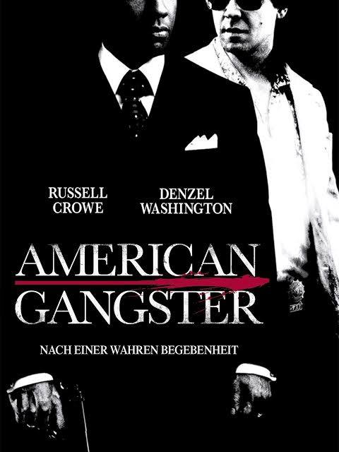

I recently watched Ridley Scott's movie "American Gangster". What started off as a casual movie watching on a flight turned out to be a delightful movie experience that I finished at home. 
The portrayal of 90s New York, the mafia, how drugs poured in and turned ordinary people and addicts was riveting. The protagonist played by Russell Crowe, is extremely righteous on one front (he refuses to take home a stash of a million dollars much to the chagrin of his colleague) - but he fights his own demons and his not so innocent when it comes to caring for his son or sleeping with his lawyer. 

A corrupt police system in New York and an officer who confiscates drugs only to sell them on the market by himself, a brilliant political storyline encompassing the Vietnam War, smuggling of drugs through the US military, and another police officer's dogged perseverance to get the villain (a menacing villain role played by the brilliant Denzel Washington) - this is a movie that has got it all. Above all, an arrested villain who conspires with the hero by helping him provide evidence for hundred more confiscations and arrests and the collective effort in taking down the drug mafia and a corrupt police system that was hand in glove with it. Added to that, the racism experienced by Frank Lucas (played by Denzel) by Italian mafia who don't want him around - this movie was an excellent potpourri of a commerical entertainer with politics of race, military, drugs and stylish but realistic action sequences. 

To believe that all this actually happened in real life is even more surreal !

