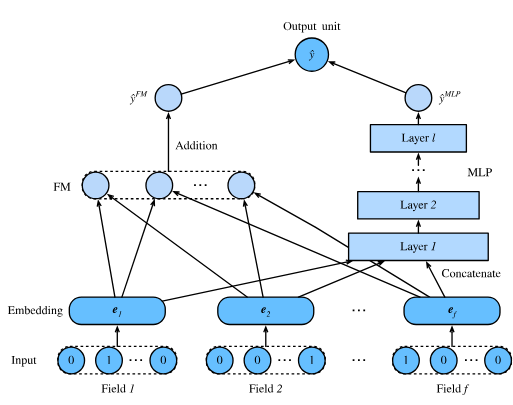
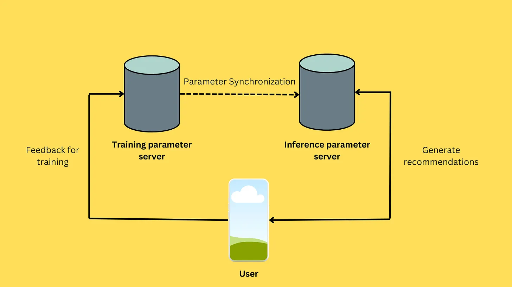
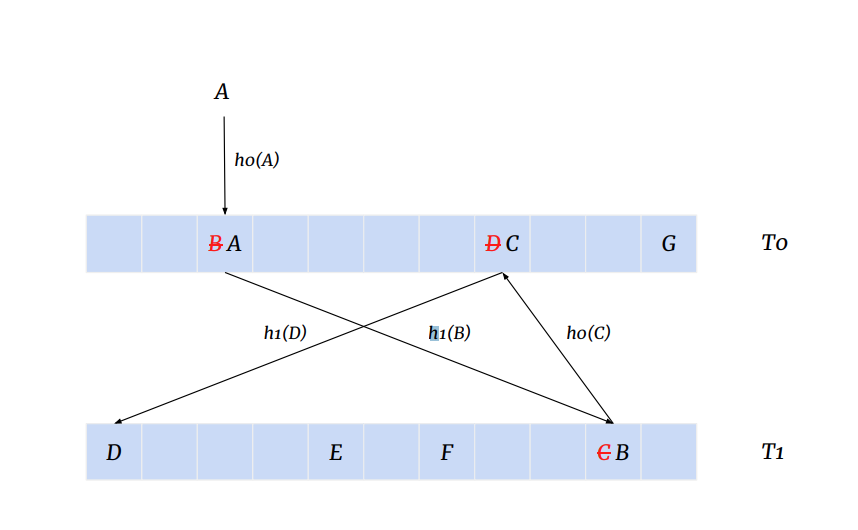

### Introduction

I recently read an excellent paper from Bytedance, that described their Monolith recommendation system, used in their Byteplus offering. The paper offers several insights into training and maintaining recommender systems at an enormous scale. It outlines several engineering optimizations and tradeoffs, to do batch training followed by online learning to continously update model parameters, and also reliably update the serving instance of the model without affecting users. In this post, I would like to discuss two major dimensions along which the paper makes improvements

1. Speeding up parameter updates
2. Reducing storage requirments of parameters

### Recommender Systems

In practice, a recommendation model maintains embeddings for each user and item. For a platform like TikTok, which has billions of users and billions of videos generated everyday, maintaining such a table can is a huge engineering effort. In addition, new users sign up every day and millions of videos are indexed every hour ! The paper outlines the following contributions

1. A system to do online learning based on Tensorflow's Parameter Server architecture.
2. Collisionless embedding table based on cuckoo hashing, and periodic eviction of outdated users, items based on heuristics.
3. Tips/tricks to optimize parameter updates, which is something specific to DeepFM and Wide-Deep architectures (a staple in RecSys/Ads)

The basic goal of a recommender system is to predict the preference of a certain user $u_i$ for an item $v_j$. $u_i$ and $v_j$ are each represented as embeddings, which are essentially learnable vector representations for each user and each item. With a growing user base, and volume of videos generated, it is easy to see why maintaining dense vector representations for each user and video can quickly blow up memory/space requirements. The industry standard for recommendation systems is the Wide and Deep architecture. The Deep architecture allows for the model to learn a combination of dense and sparse features. In this case, dense refers to parameters of the machine learning models and sparse refers to the parameters stored in embedding tables. Two  insights are exploited to optimize parameter updates is that 

1. Sparse parameters make up for much of the storage requirements of the recommender models.  
2. Dense parameters get updated less slowly than their sparse counterparts - the reason being that these models are deep learning models trained on momentum based optimizers. As a result, momentum somewhat slows down the rate of parameter updates. 

Following is an simplified architecture of DeepFM.

As observed, the sparse component, which does not have momentum based optimizers, is likely to get updated much more frequently than the dense component. However the key thing to note is that, in an online learning setting, *only a small fraction of user and video interactions may be available to learn from*. In addition, other crucial insights that are exploited in the paper are, 

3. Features can get outdated very quickly (data drift)
4. There is a long tailed distribution of users, and items which are interacted, and optimizing for the head yields huge benefits and also is more of a low hanging fruit, owing to the higher data availability.
5. Recent user-item interactions are a lot more critical than past user-item interactions.

### Training and Inference Server architecture

The training systems are based on Tensorflow's parameter server (PS) architecture, outlined as below. 

There is a training PS and an inference PS. The training PS is responsible for both batch training as well as online training, while the inference PS is responsible for serving the model to the users. As parameter sizes scale up exponentially with increasing users and videos, it is critical for the inference PS to keep running without any downtime and without affecting the users. In order to keep the parameters fresh and up-to-date, models are trained on an hourly basis. The real challenge (and one which the paper solves for) is *syncing the parameters from training PS to inference PS*. Insights 1 and 2 are exploited to make the parameter updates optimized for speed. Since the online learning setting has only a small fraction of users and items to learn from, only the embeddings for these users, and items are synced with the inference PS. In addition, since dense parameters evolve more slowly than their sparse counterparts, they are synced less frequently compared to their sparse counterparts, and it is observed that serving a relatively stale version of dense parameters is feasible without much loss in AUC (Area Under Curve)

### Collisionless Embeddings

As a platform with growing number of users, and videos being produced in the billions every day, it becomes critical to ensure memory requirements for embedding tables don't get blown up quickly. To fetch embeddings, each user ID/item ID is first converted to a hash index, which corresponds to its corresponding index in the embedding table. To mitigate hash collisions, the Monolith uses a hashing scheme called Cuckoo hashing. Cuckoo hashing works by using two hash functions $h_0$ and $h_1$ and two separate hash tables. Consider an item $x$. First $h_0(x) = i$ is calculated and it is seen if there is a collision observed. If a collision occurs, then the item previously present at $i$, (say $y$) is *evicted from the first hash table* and the system tries to *place it in the second hash table $h2$ by applying $h2(y)$*. Following is an excellent [interactive visualization](https://www.itu.dk/people/maau/teaching/visualisation/cuckoo-hashing/index.html) of cuckoo hashing. 

Based on insight 4 and 5, the system optimizes for space requirements to maintain an embedding table at this scale. Given the long tailed nature of the interactions, only users and items that pass a certain threshold of interactions are actually added into the hash table. There are also probabilistic filtering schemes applied. In addition, owing to insights 3 and 5, older entries are periodically evicted to ensure a fresher data distribution is fed to the model for online learning.

References:

1. [Dhruvil Karani's excellent blog](https://dhruvil.substack.com/p/paper-summary-monolith-real-time) post on Monolith
2. [Aaron Abraham's excellent blog](https://www.aaronabraham.ca/technical-writing/tiktok-monolith-system) post on Monolith
3. [The Monolith paper](https://arxiv.org/pdf/2209.07663)