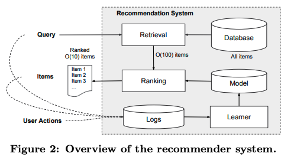
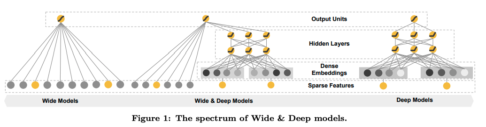
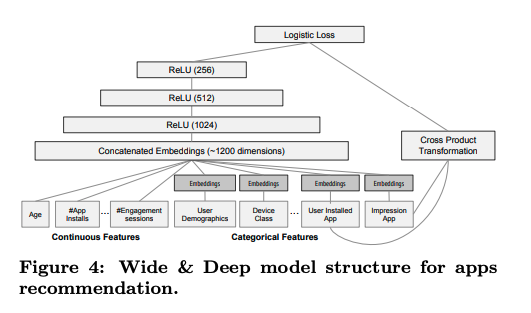
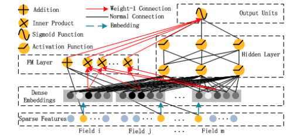

### Introduction

I recently read two papers that practically laid the foundation for large scale ML powered recommender systems in industry. The first one is Wide and Deep Learning from Google, and the second paper, DeepFM which builds upon the former. In this post, I will share key insights I learned from both these papers. 

The papers mainly focus on two tradeoffs in a recommender system

1. Memorization - Capturing frequency based, co-occurence based patterns (precision)
2. Generalization - Improving diversity of recommended systems by learning representations in an embedding space (recall)

Frequency based features, co-occurrences and other cross features can capture the memorization aspect very well. But to generalize to a wider array of items, the require extensive feature engineering. On the other hand, embedding based features are excellent at generalizing to unseen query-item pairs, but often can lead to recommendations that are irrelevant, especially the case when user-item features are sparse.

Industry scale recommender systems usually are multi-funneled and consist of several candidate generation and ranking components. Both papers focus on ranking models that re-rank a candidate set of items into an ordered list. The recommendation systems powered by Wide and Deep models was deployed on Google's Play Store for recommending mobile apps - a marketplace with >1B active users >1M mobile apps. Similarly, DeepFM was also tested on Huawei's App Store dataset while optimizing for CTR prediction.

### Wide and Deep Learning

#### Wide component

The wide component is a linear regression model of the form $y=w^{T}x+b$, where $x=[x_1, x_2, x_3, ... x_d]$ is a set of features, $w$ is a set of weights, and $b$ is the bias component. In addition to raw features, the feature set also includes transformed features, namely cross-product features, of the form 

$$
\phi(k) = \prod_{i=1}^{d} x_i^{c_{ki}}
$$

$\phi(k)$ is a pre-defined transformation. For eg: A transformation could be defined as whether a user has installed Netflix and is male, in which case it would be (installed_Netflix=true, gender=Male). The value is 1, if all the conditions defined in the transformation is true, and 0 otherwise. This allows the linear regression model to capture a wide variety of feature interactions and adds non-linerity as a result of the feature interactions. 

#### Deep component

The deep part of the architecture is a multi layer deep neural network, where the categorical features are transformed into embeddings. Every categorical feature is converted into an embedding of dimension $O(10)$ to $O(100)$. Embeddings obtained from categorical features are concatenated with the continuous features like age, number of app installs, etc. The values obtained from the wide and deep part is combined in a weighted combination and finally passed to a sigmoid layer to obtain the final loss.

#### Optimization algorithm

The optimizer algorithm used for the Wide Part is FTRL (Follow the Regularized Leader), while the deep part uses an Adagrad optimizer.

### DeepFM

DeepFM builds on the Wide and Deep architecture by introducing a factorization machine instead of the linear model and cross-product feature interactions. This gives representation learning ability to the wide component as well, in addition to the deep component. In a joint training setting, the same set of embeddings are used for both wide and deep parts of the network. Both the wide and deep parts are jointly optimized using gradient descent. 

#### Factorization Machine

$$
y_{F M}=\langle w, x\rangle+\sum_{j_1=1}^d \sum_{j_2=j_1+1}^d\left\langle V_i, V_j\right\rangle x_{j_1} \cdot x_{j_2},
$$

The first part of the equation is a linear model, while the second term captures second order, non-linear interactions. While theoretically, a factorization machine can have interactions upto any $n^{th}$ order, the paper sticks to second order, due to computational reasons. Feature interactions are captured with the help of latent vectors $V_i$ and $V_j$ for each feature $i$ and $j$.
